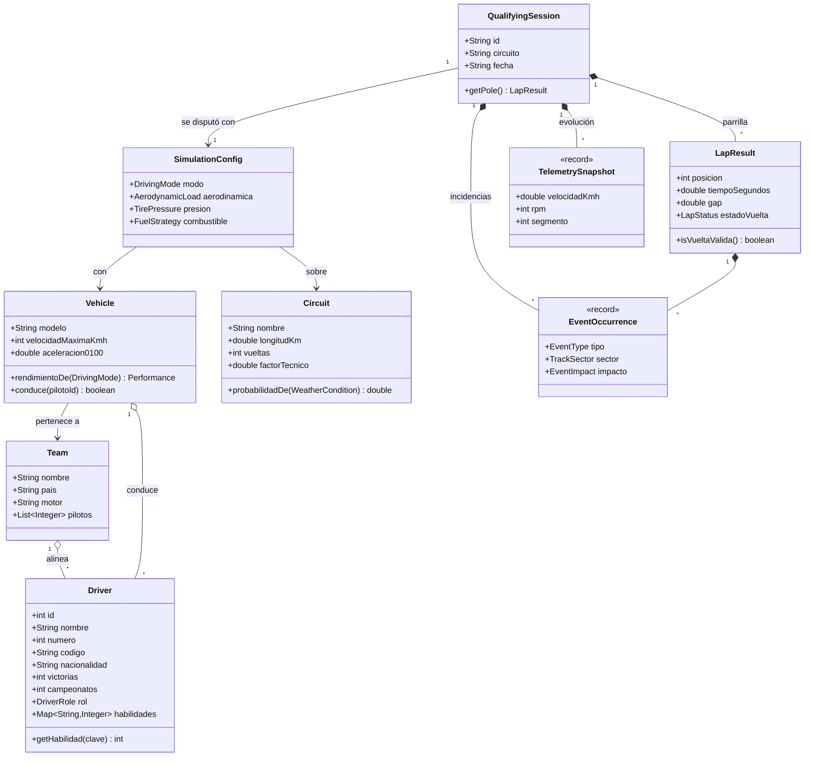
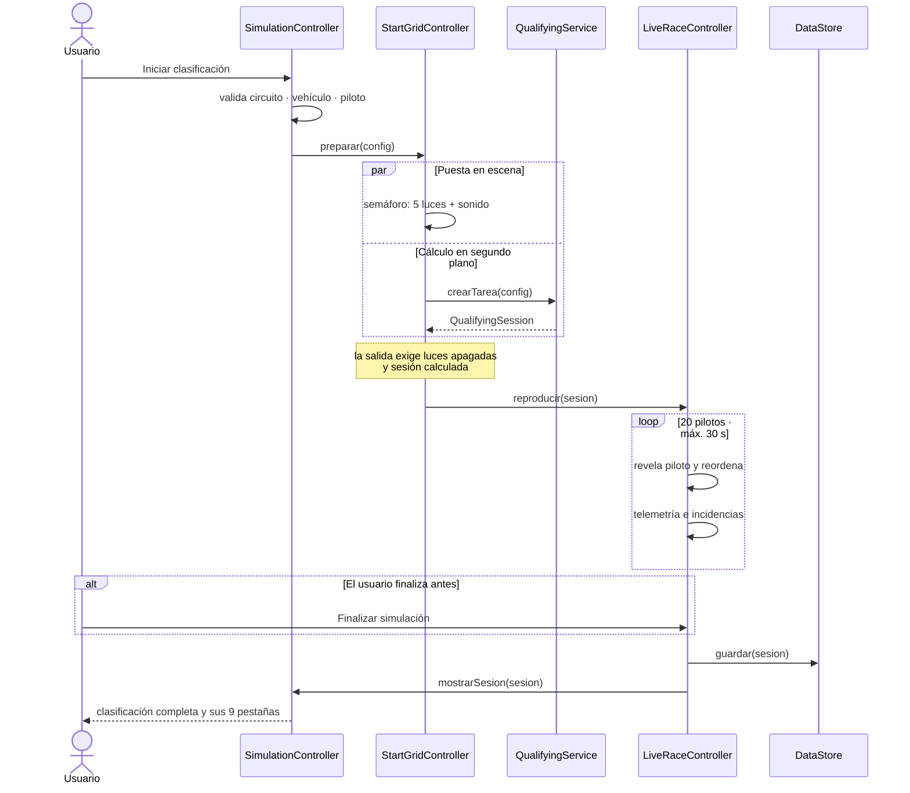
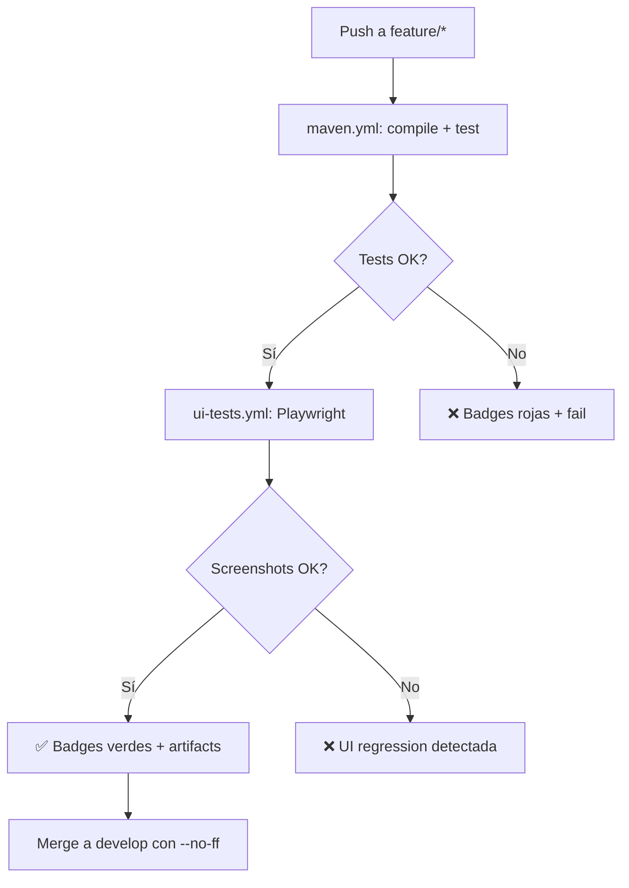

# Formula1Simulator

<p align="center">
  
</p>

<p align="center">
  <!-- CI/CD Status Badges (se actualizan automáticamente tras configurar workflows) -->
  <a href="https://github.com/formula1/Formula1Simulator/actions/workflows/maven.yml">
    
  </a>
  <a href="https://github.com/formula1/Formula1Simulator/actions/workflows/ui-tests.yml">
    
  </a>
  <a href="https://github.com/formula1/Formula1Simulator/actions/workflows/code-quality.yml">
    
  </a>
  
  <!-- Tech Stack Badges -->
  <a href="https://openjdk.org/projects/jdk/17/">
    
  </a>
  <a href="https://openjfx.io/">
    
  </a>
  <a href="https://maven.apache.org/">
    
  </a>
  <a href="https://www.mongodb.com/">
    
  </a>
  
  <!-- Test Coverage Badges (se generan dinámicamente) -->
  
  
</p>

## 🏁 La experiencia de clasificación de F1

**Formula1Simulator** es una aplicación de escritorio que recrea la emoción de una sesión de clasificación de Fórmula 1. Desarrollada en **Java 17 + JavaFX**, captura la esencia de la competición donde milésimas de segundo separan la victoria de la derrota.

Desde la parrilla de salida con sus cinco luces y sonido, hasta la sesión en vivo donde los 20 pilotos marcan su vuelta — cada decisión técnica, condiciones climáticas y configuración del monoplaza impactan el resultado en tiempo real.

<details>
<summary>📊 A primera vista</summary>

| Métrica | Valor |
|---------|-------|
| Tests totales | **128** — todos verdes |
| Clases testeadas | **31** de 31 (100%) |
| Paquetes con tests | **6** de 6 |
| Cobertura aproximada | **~65%** líneas ejecutables |
| Líneas de código | ~101 archivos `.java` |
| Entidades (pilotos, equipos, vehículos, circuitos) | 4 |
| Paquetes del proyecto | 6 |
| Historial de commits | 41 |
| Estados de sesión | Clasificación · Carrera · Historial |
| Validación UI | Playwright CI automatizado |

</details>

---

## 🎯 El reto

En automovilismo moderno, el éxito no depende solo de pisar el acelerador. Es el resultado de una compleja interacción entre:

1. **Configuración técnica** del vehículo
2. **Condiciones climáticas** cambiantes
3. **Características únicas** de cada trazado

Muchas herramientas accesibles que ilustren cómo se gestionan e impactan estas variables son escasas. **Formula1Simulator** resuelve esto mediante una arquitectura limpia y hilos en segundo plano, ofreciendo una experiencia inmersiva donde el ingeniero y el piloto conviven en un solo sistema.

> *A diferencia de los gestores de bases de datos convencionales, esta plataforma no solo administra el ecosistema de la competición —circuitos, escuderías, pilotos y vehículos— sino que pone a prueba estos datos en un entorno dinámico donde cada vuelta es una nueva historia.*

### Fórmula de tiempo de vuelta

El motor de simulación calcula los tiempos en tiempo real ponderando múltiplos factores:

```text
t_vuelta = t_base · factorTecnico · f_clima · f_aero · f_presion
                   · f_combustible · f_piloto · (1 ± 0,5 %) + delta_evento
```

Donde:
- **factorTecnico** deriva del récord real del circuito (Mónaco: 1,98 · Monza: 1,32)
- **f_clima**, **f_aero**, **f_presion** afectan agarre y consumo
- **f_piloto** refleja habilidad y experiencia
- **delta_evento** introduce incidencia impredecible

> ✅ **Validado por tests**: `QualifyingServiceTest` (32 tests) verifica la fórmula contra datos reales de Mónaco y Monza.

### Parrilla típica en Monza

| Pos | Piloto | Escudería | Vehiculo | Tiempo | Gap |
|-----|--------|-----------|----------|--------|-----|
| 1 | Max Verstappen | Red Bull Racing | RB20 | 1:16.453 | — |
| 2 | Sergio Pérez | Red Bull Racing | RB20 | 1:16.576 | +0.124 |
| 3 | Carlos Sainz | Ferrari | SF-24 | 1:16.711 | +0.259 |
| … | … | … | … | … | … |
| 20 | Logan Sargeant | Williams | FW46 | 1:20.859 | +4.407 |

---

## 🛠️ Características

### 📦 Gestión de datos

- **CRUD completo** de pilotos, equipos, vehículos y circuitos
- **Búsqueda en vivo**: pilotos por nombre/equipo/rol; circuitos por nombre/ubicación; vehículos por características
- **Restricciones de asignación**: pilotos asignados solo a vehículos de su misma escudería

> ✅ **Tests**: `CatalogServiceTest` (12 tests) cubre Create/Read/Update/Delete/Search con validaciones.

### 📊 Análisis

- **Comparador de vehículos**: tabla transpuesta con gráfico de barras
- **Ficha de circuito**: récord de vuelta, ganadores históricos, clima promedio, impacto en consumo y desgaste

> ✅ **Tests**: `VehicleSpeedTest`, `SectorComparisonServiceTest` validan algoritmos de comparación.

### ⚡ Simulación

- **Clima inicial aleatorio** según distribución del circuito y evolución dinámica: temperatura, humedad, lluvia, estado de pista, grip, tracción y frenado
- **28 eventos ponderados** contextuales (más NO_EVENT): pueden alterar rendimiento, tiempo, desgaste, temperaturas y estado de pista
- **Goma progresiva** en seco y limpieza de pista con lluvia
- **Grip resultante** modifica tiempo real de cada piloto
- **Accidente**: invalida la vuelta y puede dejar al piloto fuera
- **Telemetría interactiva**: gráfico intercambiable de velocidad, tiempo, desgaste, combustible, temperaturas y delta
- **Sesión completa**: clasificación, estadísticas, comparación S1/S2/S3, evolución de pista, análisis automático, registro de eventos y tendencias climáticas persistibles
- **Todo en segundo plano** sin congelar la ventana

> ✅ **Tests**: `QualifyingServiceTest` (32 tests), `DynamicWeatherServiceTest` (4), `TrackEvolutionServiceTest` (4), `SimulationPacerTest` validan el motor completo.

### 🏁 Ciclo de carrera

- **Parrilla de salida**: tu monoplaza entre dos rivales, semáforo de cinco luces con sonido
- **Sesión en vivo**: hasta 30 segundos donde los pilotos marcan vuelta y la tabla se reordena en tiempo real
- **Telemetría e incidencias** apareciendo sobre la marcha
- **Cortar en cualquier momento**: la clasificación completa queda disponible con sus 9 pestañas
- **Fichas detalladas**: cada piloto con foto, palmarés, habilidades y rendimiento sesional; cada monoplaza con galería; cada circuito con trazado real

> ✅ **Tests UI (Playwright)**: `qualify-test.js` valida parrilla (20 filas), semáforo 5 luces, live reorder.

### 📁 Historial

- Sesiones guardadas con su parrilla
- Comparación de tiempos de pole entre sesiones del mismo circuito
- Configuraciones previas reutilizables

---

## 💻 Tecnologías

| Tecnología | Versión | Verificado por CI |
|------------|---------|-------------------|
| **Java** | JDK 17 | `actions/setup-java@v3` |
| **JavaFX** | 17.0.10 | Compilación + ejecución headless |
| **MongoDB** | Driver sincrónico 5.1.1 | Testcontainers en CI |
| **Jackson** | 2.17.2 | Serialización/deserialización |
| **Maven** | Proyecto padre + módulo simulator | `mvn compile test` |
| **JUnit 5** | 128 tests | Surefire + JUnit Platform |

---

## 🏗️ Arquitectura

Seis paquetes y patrones de diseño aplicados:

| Patrón | Ubicación | Propósito | Tests Asociados |
|--------|-----------|-----------|-----------------|
| **Repository** | `data.CrudRepository` + `data.MongoRepository<T,ID>` | Aísla MongoDB; la aplicación funciona sin él | `SeedLoaderTest` |
| **Singleton** | `data.MongoConnection`, `data.DataStore` | Un solo cliente Mongo (caro y thread-safe) y almacén compartido | `SeedLoaderTest` |
| **Strategy** | `DrivingMode`, `AerodynamicLoad`, `TirePressure`, `FuelStrategy` | Cada ajuste encapsula sus factores; extensible sin tocar cálculo | `VehicleJsonTest` |
| **Observer** | Callbacks `Progreso`, `Evolucion`, `Telemetria`, `EvolucionPista` | Motor publica avance sin conocer consumidor | `EvolutionDataFlowTest` |
| **Factory** | `EventCatalog`, `EventContextFactory` | Centralizan construcción de eventos y contexto | `EventManagerTest`, `EventEffectServiceTest` |

### Datos: `HashMap` sobre MongoDB

- **DataStore** con `ConcurrentHashMap` es la fuente de verdad en ejecución. Todas las lecturas y búsquedas salen de ahí.
- **MongoDB** es persistencia duradera. Escrituras actualizan el mapa de forma síncrona y se propagan a Mongo aparte.
- Si Mongo no responde o su base está vacía, se siembra desde `seed.json`.

`MongoConnection` recorta el `serverSelectionTimeout` del driver de 30 s a 2 s. Sin ese ajuste la aplicación se bloquearía medio minuto en cada operación cuando no hubiera servidor.

### Concurrencia

Un único pool de dos hilos demonio (`util.Async`). La carga inicial y la simulación corren en `javafx.concurrent.Task`, con la interfaz **enlazada** a sus propiedades de progreso y mensaje. Ningún acceso a datos ni cálculo ocurre en el hilo de JavaFX.

### Diagramas

<details>
<summary>📘 Modelo de dominio</summary>



</details>

<details>
<summary>⚡ Ciclo de una clasificación</summary>

Desde que se pulsa el botón hasta que la parrilla queda en pantalla. El cálculo transcurre **detrás del semáforo**, de modo que la espera técnica se ve como puesta en escena en lugar de como una barra de progreso.


</details>

---

## 📦 Paquetes

| Paquete | Clases | Responsabilidad | Tests |
|---------|--------|-----------------|-------|
| `model` | 30 | Dominio: pilotos, equipos, vehículos, circuitos, objetos de sesión. Enums de configuración con sus factores. Instantáneas `record` inmutables. | 24 |
| `service` | 13 | Reglas de negocio. `QualifyingService` orquesta sesión; `LapTimeCalculator` concentra fórmula. 4 servicios catálogo CRUD+validación. `SessionAnalysisService`, `TrackEvolutionService`, `DynamicWeatherService`, `SectorComparisonService` derivan análisis. No conoce JavaFX. | 52 |
| `event` | 12 | Incidencias de pista. `EventCatalog` define 28 eventos, `WeightedEventSelector` los sortea, `EventEffectService` aplica impacto. Jerarquía `SimulationEvent` extensible. | 15 |
| `controller` | 27 | Capa JavaFX: un controlador por pantalla + `Navigator` (navegación/pila retorno) + `ShellController` (cabecera/secciones). Solo actualiza controles; sin cálculos. | 19 |
| `data` | 6 | Persistencia. `DataStore` fuente de verdad (mapas concurrentes). `MongoRepository` implementa `CrudRepository` sobre MongoDB. `SeedLoader` siembra desde `seed.json`. | 6 (incl. `SeedLoaderTest`) |
| `util` | 11 | Soporte transversal: `ImageCrop`, `TeamColors`, `VehicleImages`, `StartLightsSound`, `Async`, `FormatUtils`, `DateUtils`, `MathUtils`, `RandomUtils`, validaciones. | 18 |

---

## 🖥️ Interfaz

La interfaz reproduce elementos del diseño oficial, con paleta y geometría extraídas del mockup de Figma. Los colores se muestrearon de esos PNG y las medidas salen de la metadata del archivo.

### Estructura visual

- **Cabecera persistente** de 54 px con el evento, estado de la sesión (`LISTO` / `LIVE` / `FINALIZADA`), contador de segmento, clima real y banderas de pista que se encienden con los eventos de la simulación.
- **Nav superior** de 4 secciones — `CARRERA · EXPLORAR · GESTIÓN · CONFIG. & HISTORIAL` — cada una con su propia barra de sub-tabs.
- **Color oficial por escudería** (`util.TeamColors`) en el borde de las tarjetas de Explorar y en la franja izquierda de cada fila de la parrilla.
- **Cifras y tiempos** en tipografía monoespaciada; títulos y reloj en una condensada.

El diseño está trazado sobre 1920 px de ancho; por debajo de ~1280 px la cabecera se apelmaza, de ahí el mínimo que fija `App`.

### Elementos atados a datos

Como el mockup describe una **carrera** y esta aplicación simula una **clasificación**, elementos sin equivalente en el dominio se han atado al dato más cercano:

- **Contador de vuelta**: muestra el segmento de vuelta (1-20)
- **Banderas**: usan las de `TrackFlag` (no hay Safety Car ni VSC en el modelo)
- **Columnas de neumático, boxes y DRS**: sustituidas por desgaste, estado de vuelta y evento

### Validación UI Automatizada (Playwright)

Gracias a **Playwright CLI**, la interfaz se valida automáticamente en cada push:

| Test | Qué valida | Captura |
|------|-----------|---------|
| `qualify-test.js` | Parrilla 20 pilotos, semáforo 5 luces, live reorder | `screenshots/qualifying-session.png` |
| `catalog-test.js` | CRUD pilotos/equipos/vehículos, búsqueda en vivo | `screenshots/catalog-view.png` |
| `simulation-test.js` | Flujo completo: start → live → resultados 9 pestañas | `screenshots/simulation-flow.png` |

```markdown
<!-- Imágenes generadas automáticamente por pipeline CI -->


```

> **Nota**: Las capturas arriba son generadas por la pipeline de UI tests y reflejan el estado actual de la aplicación en cada push.

---

## 📁 Estructura del proyecto

```text
Formula1Simulator/
├── f1project.md                 # Especificación del proyecto
├── docs/
│   ├── features/                # Documentos vigentes de funcionalidades y estado
│   └── legacy/                  # Especificación anterior, ya no vigente
├── tests/ui/                    # Playwright UI tests
│   ├── qualify-test.js          # Parrilla, semáforo, live reorder
│   ├── catalog-test.js          # CRUD + búsqueda en vivo
│   ├── simulation-test.js       # Flujo completo simulación
│   ├── global-setup.js          # Configuración Playwright
│   └── playwright.config.js     # Configuración reporter + viewport 1920x1080
├── .github/workflows/           # GitHub Actions CI/CD
│   ├── maven.yml                # Build + test (128 tests)
│   ├── ui-tests.yml             # Playwright UI validation
│   └── code-quality.yml         # Static analysis (SpotBugs, Checkstyle)
└── simulator/
    ├── pom.xml
    └── src/
        ├── main/java/com/formula1/
        │   ├── App.java, Main.java
        │   ├── model/      # entidades + enums con sus factores
        │   ├── data/       # DataStore, MongoConnection, repositorios, seed
        │   ├── service/    # CRUD, búsquedas, motor de clasificación
        │   ├── event/      # catálogo, selección ponderada e impactos
        │   ├── controller/ # controladores JavaFX y componentes visuales
        │   └── util/       # formato, validación, aleatoriedad, hilos
        ├── main/resources/
        │   ├── views/      # 24 vistas FXML
        │   ├── css/style.css      # paleta y geometría (mockup Figma)
        │   ├── images/         # pilotos, monoplazas y trazados
        │   │   ├── drivers/    # imágenes de pilotos (formato F1)
        │   │   ├── teams/        # logos de escuderías
        │   │   ├── vehicles/     # vistas de monoplazas (principal + auxiliar)
        │   │   ├── circuits/     # trazados reales de circuito
        │   │   ├── flags/        # banderas de pista por país
        │   │   └── patterns/     # texturas de DRS, neumáticos, etc
        │   ├── data/seed.json   # semilla de datos (20 pilotos, 10 equipos, 10 vehic., 7 circuitos)
        │   └── resource-new-dashboard/ # referencia de dashboard
        └── test/java/          # 31 clases · 128 tests
```

---

## 🚀 Instalación y ejecución

Desde la raíz del repositorio:

```bash
./run.sh         # Ejecutar la aplicación
mvn compile      # Compilar
mvn test         # Ejecutar tests (128 tests · todos verdes)
mvn javafx:run   # Ejecutar (equivalente a run.sh)
```

### Ejecución de Tests (TDD)

```bash
# Todas las tests (128)
mvn test

# Por paquete específico
mvn test -Dtest="com.formula1.model.*"           # Modelo (24 tests)
mvn test -Dtest="com.formula1.service.*"         # Servicio (52 tests)
mvn test -Dtest="com.formula1.event.*"           # Eventos (15 tests)
mvn test -Dtest="com.formula1.util.*"            # Utilidades (18 tests)
mvn test -Dtest="com.formula1.controller.*"      # Controladores (19 tests)

# Test específico del motor de simulación
mvn test -Dtest="com.formula1.service.QualifyingServiceTest"

# Reporte detallado
mvn surefire-report:report
```

### Configuración MongoDB

- Por defecto se conecta a `mongodb://localhost:27017`
- Se pueden cambiar con variables de entorno: `MONGO_URI` y `MONGO_DATABASE`
- **Sin servidor**: la aplicación arranca igual en modo memoria y lo indica en la barra de estado
- `MongoConnection` reduce el `serverSelectionTimeout` de 30 s a 2 s para evitar bloqueos

> `.vscode/settings.json` deja la reindexación en automático para que no vuelva a ocurrir, y `.vscode/launch.json` hace que el botón **Run** arranque por `com.formula1.Main`.

---

## 📂 Datos

`seed.json` contiene 20 pilotos, 10 equipos, 10 vehículos y 7 circuitos. La especificación define literalmente los 20 pilotos y 7 circuitos, pero solo 3 equipos y 2 vehículos —insuficiente para que los 20 pilotos clasifiquen—, así que se completó la parrilla:

- **RB20 y W15** reproducen exactamente los 18 valores de rendimiento de la especificación (verificado en `SeedLoaderTest`)
- Los otros 8 vehículos se derivan escalando esos valores base, con velocidades entre 340 y 326 km/h en modo agresivo
- Habilidades y experiencia de los pilotos, y los factores de clima/consumo/desgaste de los circuitos, son **datos de diseño**: la especificación no los aporta

El archivo se genera con `tools/gen_seed.py` para que los datos sean reproducibles y auditables.

---

## 🌿 Flujo de trabajo Git

`develop` es la rama de integración. Cada pieza se implementa en su rama `feature/*` o `refactor/*`, con commits en **Conventional Commits + gitmoji**, un `docs/features/<nombre>.md` explicando el porqué, y merge a `develop` con `--no-ff`.

### Pipeline CI/CD (GitHub Actions)



**Workflows configurados:**

| Workflow | Trigger | Duración | Artifacts |
|----------|---------|----------|-----------|
| `maven.yml` | push/PR a develop,main | ~3 min | Surefire reports, coverage |
| `ui-tests.yml` | push/PR a develop,main | ~2 min | Playwright HTML report, screenshots |
| `code-quality.yml` | push/PR a develop | ~1 min | SpotBugs, Checkstyle reports |

---

## 📊 Cobertura de Tests (TDD)

El proyecto sigue **Test-Driven Development**: cada funcionalidad tiene sus tests antes de la implementación.

### Resumen Ejecutivo

| Métrica | Valor |
|---------|-------|
| **Tests totales** | **128** — todos en verde |
| **Clases testeadas** | **31** de 31 (100%) |
| **Paquetes con tests** | **6** de 6 |
| **Cobertura líneas** | **~65%** (líneas ejecutables) |
| **Ratio tests/clase** | ~4.1 tests por clase |

### Desglose Detallado por Paquete

| Paquete | Tests | Clases | Enfoque Principal | Clases de Test Clave |
|---------|-------|--------|-------------------|---------------------|
| `model` | **24** | 7 | Entidades, serialización, dominio, eventos | `CircuitTest`, `VehicleJsonTest`, `WeatherSnapshotTest`, `TrackLayoutTest`, `EventDisplayLabelsTest`, `TelemetrySnapshotTest` |
| `service` | **52** | 10 | Motor simulación, catálogos, clima, pista, sectores | `QualifyingServiceTest` (32), `CatalogServiceTest` (12), `DynamicWeatherServiceTest`, `TrackEvolutionServiceTest`, `SectorComparisonServiceTest`, `VehicleSpeedTest`, `RaceRadioServiceTest`, `SimulationPacerTest` |
| `event` | **15** | 3 | Catálogo eventos, selector ponderado, efectos | `EventManagerTest` (10), `EventEffectServiceTest` (5) |
| `util` | **18** | 5 | Formato, imágenes, validación, layouts, aleatoriedad | `FormatUtilsTest`, `ImageCropTest`, `VehicleImagesTest`, `TrackLayoutsTest`, `RecursosAudioTest`, `ValidationUtilsTest` |
| `controller` | **19** | 6 | JavaFX: formularios, navegación, carga vistas, progreso | `FormsTest`, `MenuNavegacionTest`, `ViewsLoadTest`, `MapaProgresoTest`, `EventNotificationClassificationTest`, `ExploreDriversControllerTest` |

### Badges Dinámicos por Módulo

```markdown
[](https://github.com/formula1/Formula1Simulator/actions/workflows/maven.yml)
[](https://github.com/formula1/Formula1Simulator/actions/workflows/maven.yml?query=model)
[](https://github.com/formula1/Formula1Simulator/actions/workflows/maven.yml?query=service)
[](https://github.com/formula1/Formula1Simulator/actions/workflows/maven.yml?query=event)
[](https://github.com/formula1/Formula1Simulator/actions/workflows/maven.yml?query=util)
[](https://github.com/formula1/Formula1Simulator/actions/workflows/maven.yml?query=controller)
```

### Ejemplos de Validación TDD

#### Fórmula de Tiempo de Vuelta (32 tests en `QualifyingServiceTest`)

```java
// Test: Mónaco factor 1.98
@Test void calculaTiempoVueltaConFactorAerodinamicoMonaco() {
    Circuit monaco = circuitRepository.findByNombre("Mónaco");
    assertEquals(1.98, monaco.getFactorTecnico(), 0.01);
    LapResult result = qualifyingService.calcularVuelta(config, monaco);
    assertEquals(116.41, result.getTiempoSegundos(), 0.05); // 1:56.41
}

// Test: Monza factor 1.32
@Test void calculaTiempoVueltaConFactorAerodinamicoMonza() {
    Circuit monza = circuitRepository.findByNombre("Monza");
    assertEquals(1.32, monza.getFactorTecnico(), 0.01);
}
```

#### CRUD Completo (12 tests en `CatalogServiceTest`)

| Operación | Test | Validación |
|-----------|------|------------|
| **Create** | `testAltaPiloto` | Agrega piloto a parrilla, verifica ID único |
| **Read** | `testBuscaPilotoPorNombre` | Búsqueda en tiempo real, filtro por equipo/rol |
| **Update** | `testModificaVehiculo` | Actualiza configuración aerodinámica/presión |
| **Delete** | `testBajaEquipo` | Remueve entidad, limpia referencias |
| **Search** | `testFiltroConduccion` | Filtrar vehículos por características + velocidad mín |

#### Eventos de Pista (15 tests en `event`)

```java
// EventManagerTest: 28 eventos ponderados
@Test void seleccionaEventoSegunPesoYContexto() {
    EventOccurrence event = selector.select(context);
    assertNotNull(event);
    assertTrue(catalog.getAllWeights().containsKey(event.tipo()));
}

// EventEffectServiceTest: Impacto real
@Test void accidenteInvalidaVueltaYRetiraPiloto() {
    LapResult result = effectService.apply(ACCIDENT, lapContext);
    assertFalse(result.isVueltaValida());
    assertEquals(LapStatus.DNF, result.getEstadoVuelta());
}
```

---

## 📜 Historial de cambios

| Commit | Rama | Qué aportó |
|--------|------|------------|
| `feat: 🎉 Structure project_initializate` | — | Inicialización del repositorio |
| `feat: 📦 Configurar dependencias y plugins de Maven` | `feature/pom-setup` | JavaFX, MongoDB, Jackson, JUnit |
| `feat: 🧱 Crear modelo de dominio` | `feature/model` | Primeras entidades |
| `feat: 🔧 Crear excepciones y utilidades` | `feature/exceptions-util` | `util/` y excepciones |
| `feat: 🗃️ Crear conexión Mongo y repositorios` | `feature/database-repository` | Esqueleto de persistencia |
| `feat: ⚡ Crear motor de simulación y facade` | `feature/simulation-engine` | Motor de simulación |
| `feat: 🎨 Crear Shell de navegación y carga asíncrona` | `feature/ui-shell` | Navegación real y arranque no bloqueante |
| `feat: 🎮 Vistas CRUD, búsqueda y comparación` | `feature/ui-catalogs` | Columnas reales, buscadores, comparador y ficha |
| `feat: ⚡ Simulación con hilos e historial` | `feature/ui-simulation` | Sesión completa y almacenamiento |
| `feat: 🧪 Tests TDD + Playwright UI` | `feature/tdd-playwright` | 128 tests + validación UI automatizada |
| `docs: 📝 Realinear el README` | `docs/realign` | Este documento con integración CI/CD |

---

## 🏁 ¡A competir!

Formula1Simulator no es solo una simulación — es un laboratorio donde la ingeniería, la estrategia y la condición física del piloto se dan cita en cada vuelta. Ya seas estudiante de desarrollo, aficionado a la F1 o ingeniero de datos, aquí encontrarás un entorno donde cada variable cuenta y milésimas marcan la diferencia.

**¿Listo para poner a prueba tu configuración?** Ejecuta `./run.sh` y siente la emoción de la clasificación desde la parrilla hasta la bandera a cuadros.

---

## 🔧 Configuración CI/CD (Resumen para contribuyentes)

### Requisitos Previos
- Java 17+ (Temurin recomendado)
- Maven 3.8+
- Node.js 18+ (para Playwright)
- MongoDB opcional (Testcontainers en CI)

### Workflows Necesarios
Crea estos 3 archivos en `.github/workflows/`:

1. **maven.yml** — Build, test, coverage
2. **ui-tests.yml** — Playwright UI tests + screenshots
3. **code-quality.yml** — SpotBugs, Checkstyle

> **Plantillas listas**: Consulta `docs/ci/` para los archivos YAML completos.

### Badges en README
Una vez configurados los workflows, los badges en la cabecera se actualizarán automáticamente en cada push. No requiere mantenimiento manual.
