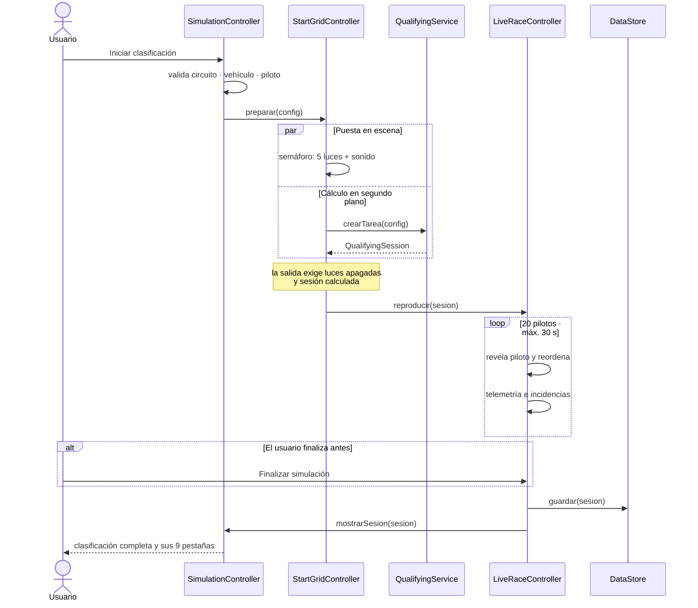

<p align="center">
  
</p>

<p align="center">
  
  
  
  
  
</p>

# Formula1Simulator

## Introducción

La Fórmula 1 es una disciplina que lleva la ingeniería y la estrategia al límite, donde milésimas de segundo separan la victoria de la derrota. **Formula1Simulator** es una aplicación de escritorio desarrollada en Java 17 y JavaFX que captura esta emoción, ofreciendo una simulación interactiva y altamente detallada de una sesión de clasificación de F1. 
## Problemática

En el automovilismo deportivo moderno, el éxito no depende únicamente de pisar el acelerador a fondo. Es el resultado de una compleja interacción entre la configuración técnica del vehículo, las condiciones climáticas cambiantes y las características únicas de cada trazado. 

A menudo, los aficionados y estudiantes de desarrollo de software carecen de herramientas accesibles que ilustren cómo se gestionan e impactan estas variables en un sistema interconectado. El desafío principal de este proyecto fue diseñar un sistema modular que pudiera:
1. Mantener un registro CRUD eficiente de las entidades del deporte (vehículos, pilotos, circuitos).
2. Procesar reglas de negocio complejas (aerodinámica, desgaste, consumo) sin bloquear la interfaz de usuario.
3. Simular eventos aleatorios y evolución de pista de manera concurrente para reflejar el caos controlado de una sesión de clasificación real.

Formula1Simulator resuelve esto mediante una arquitectura limpia y el uso de hilos en segundo plano, ofreciendo una experiencia inmersiva y un código mantenible.
A diferencia de los gestores de bases de datos convencionales, esta plataforma no solo permite administrar el ecosistema de la competición (circuitos, escuderías, pilotos y vehículos), sino que pone a prueba estos datos en un entorno dinámico. El motor de simulación calcula los tiempos de vuelta en tiempo real ponderando la habilidad del piloto, las capacidades del monoplaza, los reglajes elegidos y la evolución impredecible del clima y la pista.


Aplicación de escritorio en **Java 17 + JavaFX** para simular una sesión de **clasificación de Fórmula 1**: gestión de pilotos, equipos, vehículos y circuitos, configuración del monoplaza, y una sesión en la que los 20 pilotos marcan tiempo según su habilidad, su coche, el circuito, el clima y los ajustes elegidos.

La especificación que sigue el proyecto es [`f1project.md`](f1project.md).

---

## Tabla de contenidos

- [Estado](#estado)
- [Funcionalidades](#funcionalidades)
- [Cómo funciona la simulación](#cómo-funciona-la-simulación)
- [Tecnologías](#tecnologías)
- [Arquitectura](#arquitectura)
- [Diagramas](#diagramas)
- [Paquetes](#paquetes)
- [Interfaz](#interfaz)
- [Estructura del proyecto](#estructura-del-proyecto)
- [Instalación y ejecución](#instalación-y-ejecución)
- [Datos](#datos)
- [Flujo de trabajo Git](#flujo-de-trabajo-git)
- [Historial de cambios](#historial-de-cambios)
- [Pendiente](#pendiente)

---

## Estado

**Funcional de punta a punta.** Las 22 historias de usuario de `f1project.md` están implementadas: CRUD con búsqueda de las cuatro entidades, configuración del vehículo, simulación de clasificación con hilos y almacenamiento de resultados y configuraciones.

La aplicación **arranca y es plenamente usable con o sin MongoDB**: si no hay servidor, se siembra desde un JSON incluido y todo funciona en memoria.

| | |
|---|---|
| Archivos `.java` | 101 |
| Paquetes | 6 |
| Patrones de diseño | 2 (Repository, Singleton) |
| Tests | 121, todos en verde |

## Funcionalidades

**Gestión de datos** — Alta, consulta, edición y baja de pilotos, equipos, vehículos y circuitos, con búsqueda en vivo: pilotos por nombre/equipo/rol, circuitos **por nombre o ubicación**, vehículos **por características** (texto y velocidad mínima). Asignación de pilotos a un vehículo restringida a los de su misma escudería.

**Análisis** — Comparación de dos o más vehículos en una tabla transpuesta con gráfico de barras. Ficha de circuito con récord de vuelta, ganadores históricos, clima promedio e impacto de la pista sobre consumo y desgaste.

**Simulación** — Clima inicial aleatorio según la distribución del circuito y evolución dinámica de temperatura, humedad, lluvia, pista, grip, tracción y frenado. La goma se acumula entre vueltas en seco y la lluvia limpia progresivamente la pista; el grip resultante modifica el tiempo real de cada piloto. Incluye 28 eventos ponderados y contextuales más `NO_EVENT`: pueden alterar rendimiento, tiempo, desgaste, temperaturas y pista; un accidente invalida la vuelta y puede dejar al piloto fuera. La vuelta seleccionada muestra telemetría, clima y eventos en vivo, además de un gráfico intercambiable de velocidad, tiempo, desgaste, combustible, temperaturas y delta. La sesión incluye clasificación, estadísticas, comparación S1/S2/S3, evolución de pista, análisis automático por reglas, registro de eventos y tendencias climáticas persistibles. Todo corre en segundo plano sin congelar la ventana.

**Ciclo de carrera** — Al iniciar una clasificación se pasa por la parrilla de salida: tu monoplaza entre dos rivales y el semáforo de cinco luces con su sonido, mientras la sesión se calcula por detrás. Al apagarse las luces arranca la sesión en vivo, de hasta 30 s, en la que los pilotos van marcando su vuelta y la tabla se reordena, con la telemetría y las incidencias apareciendo sobre la marcha. Se puede cortar en cualquier momento; termine sola o se corte, la clasificación completa queda disponible con sus nueve pestañas.

**Fichas** — Cada piloto tiene ficha con foto, palmarés, habilidades y su rendimiento en las sesiones ya disputadas, accesible desde el catálogo y desde la tabla de resultados. Cada monoplaza abre una galería con sus otras vistas, y cada circuito muestra su trazado real.

**Historial** — Sesiones guardadas con su parrilla, comparación de tiempos de pole entre sesiones del mismo circuito, y configuraciones previas reutilizables.

## Cómo funciona la simulación

```
t_base   = 3600 · longitud_km / velocidad_promedio(modo)
t_vuelta = t_base · factorTecnico · f_clima · f_aero · f_presion
                  · f_combustible · f_piloto · (1 ± 0,5 %) + delta_evento
```

El **factor técnico** de cada circuito no es un número inventado: se deriva de su récord de vuelta real comparándolo con el tiempo a velocidad de referencia, lo que sitúa a Mónaco en 1,98 y a Monza en 1,32. Cada ajuste tiene contrapartida —más carga aerodinámica mejora el tiempo pero dispara el consumo; menos presión mejora el agarre pero desgasta más— para que configurar importe.

Una parrilla típica en Monza:

```
 1. Max Verstappen    Red Bull Racing   RB20    1:16.453       —
 2. Sergio Pérez      Red Bull Racing   RB20    1:16.576  +0.124
 3. Carlos Sainz      Ferrari           SF-24   1:16.711  +0.259
 …
20. Logan Sargeant    Williams          FW46    1:20.859  +4.407
```

## Tecnologías

**Java 17** · **JavaFX 17.0.10** (controls + fxml) · **MongoDB** (driver síncrono 5.1.1) · **Jackson** 2.17.2 · **Maven** · **JUnit 5**

## Arquitectura

Seis paquetes y **dos patrones de diseño**, los exigidos por el alcance principal:

| Patrón | Dónde | Por qué |
|---|---|---|
| **Repository** | `data.CrudRepository` + `data.MongoRepository<T,ID>` | Aísla MongoDB del resto y permite que la aplicación funcione sin él |
| **Singleton** | `data.MongoConnection`, `data.DataStore` | Un solo cliente de Mongo (es caro y thread-safe por diseño) y un único almacén compartido |

### Datos: `HashMap` sobre MongoDB

`f1project.md` pide «Map, HashMap: persistencia temporal de datos». Ambas cosas conviven sin contradicción:

- **`DataStore` con `ConcurrentHashMap` es la fuente de verdad en ejecución.** Todas las lecturas y búsquedas salen de ahí.
- **MongoDB es la persistencia duradera.** Las escrituras actualizan el mapa de forma síncrona (la tabla responde al instante) y se propagan a Mongo aparte.
- Si Mongo no responde o su base está vacía, se siembra desde `seed.json`.

`MongoConnection` recorta el `serverSelectionTimeout` del driver de 30 s a 2 s y expone `isDisponible()`. Sin ese ajuste la aplicación se bloquearía medio minuto en cada operación cuando no hubiera servidor.

### Concurrencia

Un único pool de dos hilos demonio (`util.Async`). La carga inicial y la simulación corren en `javafx.concurrent.Task`, con la interfaz **enlazada** a sus propiedades de progreso y mensaje. Ningún acceso a datos ni cálculo ocurre en el hilo de JavaFX.

## Diagramas


### Modelo de dominio


### Ciclo de una clasificación

Desde que se pulsa el botón hasta que la parrilla queda en pantalla. El cálculo
transcurre **detrás del semáforo**, de modo que la espera técnica se ve como puesta
en escena en lugar de como una barra de progreso.



## Paquetes

| Paquete | Clases | De qué se encarga |
|---|---:|---|
| `model` | 30 | El dominio: pilotos, equipos, vehículos y circuitos, más los objetos de una sesión (`QualifyingSession`, `LapResult`, `TelemetrySnapshot`, `WeatherSnapshot`). Los enums de configuración llevan sus propios factores, así que la regla vive junto al dato. Las instantáneas son `record` inmutables: el motor las emite desde un hilo de fondo y la interfaz las lee sin copiar. |
| `service` | 13 | Las reglas. `QualifyingService` orquesta la sesión; `LapTimeCalculator` concentra la fórmula del tiempo de vuelta; los cuatro servicios de catálogo hacen el CRUD con validación; y `SessionAnalysisService`, `TrackEvolutionService`, `DynamicWeatherService` y `SectorComparisonService` derivan el análisis. No conoce JavaFX. |
| `event` | 12 | Las incidencias de pista. `EventCatalog` define los 28 eventos, `WeightedEventSelector` los sortea con su peso y `EventEffectService` aplica el impacto sobre tiempo, desgaste, clima y validez de la vuelta. La jerarquía `SimulationEvent` permite añadir un evento nuevo sin tocar el motor. |
| `controller` | 27 | La capa JavaFX: un controlador por pantalla más `Navigator` (navegación y pila de retorno) y `ShellController` (cabecera y secciones). Solo actualiza controles; ningún cálculo ocurre aquí. |
| `data` | 6 | La persistencia. `DataStore` es la fuente de verdad en ejecución con mapas concurrentes, `MongoRepository` implementa `CrudRepository` sobre MongoDB y `SeedLoader` siembra desde `seed.json` cuando la base está vacía o no responde. |
| `util` | 11 | Apoyo transversal sin dependencias entre sí: `ImageCrop` (encaje de imágenes), `TeamColors` (paleta oficial), `VehicleImages` (rutas de las vistas), `StartLightsSound` (síntesis del semáforo), `Async` (pool de hilos), `FormatUtils`, `DateUtils`, `MathUtils`, `RandomUtils` y las validaciones. |

### Patrones aplicados

| Patrón | Dónde | Por qué |
|---|---|---|
| **Repository** | `data.CrudRepository` + `data.MongoRepository<T,ID>` | Aísla MongoDB del resto y deja que la aplicación funcione sin él |
| **Singleton** | `data.MongoConnection`, `data.DataStore` | Un solo cliente de Mongo (caro y thread-safe por diseño) y un único almacén compartido |
| **Strategy** | `DrivingMode`, `AerodynamicLoad`, `TirePressure`, `FuelStrategy` | Cada ajuste encapsula sus factores; añadir uno nuevo no toca el cálculo |
| **Observer** | Callbacks `Progreso`, `Evolucion`, `Telemetria`, `EvolucionPista` | El motor publica su avance sin conocer a quién lo pinta |
| **Factory** | `EventCatalog`, `EventContextFactory` | Centralizan la construcción de los eventos y su contexto |

## Interfaz

La interfaz reproduce el mockup de Figma del equipo, cuyas capturas están en
`docs/assets/F1_Recursos_Multimedia/Mockup_Design/`. La paleta y la geometría no
son aproximaciones: los colores se muestrearon de esos PNG y las medidas salen de
la metadata del archivo de Figma.

- **Cabecera persistente de 54 px** con el evento, el estado de la sesión
  (`LISTO` / `LIVE` / `FINALIZADA`), el contador de segmento, el clima real y las
  banderas de pista, que se encienden con los eventos de la simulación.
- **Nav superior de 4 secciones** — `CARRERA · EXPLORAR · GESTIÓN · CONFIG. & HISTORIAL` —
  y cada sección lleva su propia barra de sub-tabs.
- **Color oficial por escudería** (`util.TeamColors`) en el borde de las tarjetas de
  Explorar y en la franja izquierda de cada fila de la parrilla.
- Cifras y tiempos en tipografía monoespaciada; títulos y reloj en una condensada.

El diseño está trazado sobre 1920 px de ancho; por debajo de ~1280 la cabecera se
apelmaza, de ahí el mínimo que fija `App`.

Como el mockup describe una **carrera** y esta aplicación simula una
**clasificación**, hay elementos sin equivalente en el dominio. En vez de dejarlos
como adorno fijo, cada uno se ató al dato más cercano que sí existe: el contador de
vuelta muestra el segmento de vuelta (1-20), las banderas usan las de `TrackFlag`
(no hay Safety Car ni VSC en el modelo), y las columnas de neumático, boxes y DRS
se sustituyeron por desgaste, estado de vuelta y evento.

## Estructura del proyecto

```text
Formula1Simulator/
├── f1project.md                 # Especificación del proyecto
├── docs/
│   ├── features/                # Documentos vigentes de funcionalidades y estado
│   └── legacy/                  # Especificación anterior, ya no vigente
├── tools/
│   ├── gen_seed.py              # Genera seed.json de forma reproducible
│   └── copiar_imagenes.py       # Redimensiona y normaliza las imágenes
└── simulator/
    ├── pom.xml
    └── src/
        ├── main/java/com/formula1/
        │   ├── App.java, Main.java
        │   ├── model/      # entidades + enums con sus factores
        │   ├── data/       # DataStore, MongoConnection, repositorios, seed
        │   ├── service/    # CRUD, búsquedas, motor de clasificación
        │   ├── event/      # catálogo, selección ponderada e impactos
        │   ├── controller/ # controladores JavaFX y componentes visuales
        │   └── util/       # formato, validación, aleatoriedad, hilos
        ├── main/resources/
        │   ├── views/      # 24 vistas FXML
        │   ├── css/style.css
        │   ├── images/     # pilotos, monoplazas y trazados
        │   └── data/seed.json
        └── test/java/      # 28 clases · 121 tests
```

## Instalación y ejecución

```bash
cd simulator

mvn compile      # compilar
mvn javafx:run   # ejecutar
mvn test         # pruebas
```

MongoDB es **opcional**. Por defecto se conecta a `mongodb://localhost:27017`; se puede cambiar con las variables de entorno `MONGO_URI` y `MONGO_DATABASE`. Sin servidor, la aplicación arranca igual en modo memoria y lo indica en la barra de estado.

## Datos

`seed.json` contiene 20 pilotos, 10 equipos, 10 vehículos y 7 circuitos. La especificación define literalmente los 20 pilotos y 7 circuitos, pero solo 3 equipos y 2 vehículos —insuficiente para que los 20 pilotos clasifiquen—, así que se completó la parrilla:

- **RB20 y W15 reproducen exactamente** los 18 valores de rendimiento de la especificación (verificado en `SeedLoaderTest`).
- Los otros 8 vehículos se derivan escalando esos valores base, con velocidades entre 340 y 326 km/h en modo agresivo.
- Habilidades y experiencia de los pilotos, y los factores de clima/consumo/desgaste de los circuitos, son **datos de diseño**: la especificación no los aporta.

El archivo se genera con `tools/gen_seed.py` para que los datos sean reproducibles y auditables.

## Flujo de trabajo Git

`develop` es la rama de integración. Cada pieza se implementa en su rama `feature/*` o `refactor/*`, con commits en **Conventional Commits + gitmoji**, un `docs/features/<nombre>.md` explicando el porqué, y merge a `develop` con `--no-ff`.

## Historial de cambios

| Commit | Rama | Qué aportó |
|---|---|---|
| `feat: 🎉 Structure project_initializate` | — | Inicialización del repositorio |
| `feat: 📦 Configurar dependencias y plugins de Maven` | `feature/pom-setup` | JavaFX, MongoDB, Jackson, JUnit |
| `feat: 🧱 Crear modelo de dominio` | `feature/model` | Primeras entidades |
| `feat: 🔧 Crear excepciones y utilidades` | `feature/exceptions-util` | `util/` y excepciones |
| `feat: 🗃️ Crear conexión Mongo y repositorios` | `feature/database-repository` | Esqueleto de persistencia |
| `feat: 🛰️ Crear adapter de OpenF1` | `feature/api-openf1` | *(retirado después)* |
| `feat: ⚙️ Crear capa de servicios` | `feature/service` | Esqueleto de servicios |
| `feat: 🏁 Crear motor de simulación y facade` | `feature/simulation-engine` | Esqueleto del motor |
| `feat: 🎮 Crear controllers de JavaFX` | `feature/controllers` | Controladores iniciales |
| `feat: 🎨 Crear bootstrap de JavaFX` | `feature/javafx-bootstrap` | Arranque y vistas placeholder |
| `docs: 📝 Crear README` | `feature/readme` | Documentación inicial |
| **`refactor: 🔥 Recortar el alcance a f1project.md`** | `refactor/scope-cleanup` | Elimina OpenF1, Q1/Q2/Q3 y telemetría: 64 → 44 archivos, 4 → 2 patrones |
| **`feat: 🧱 Rediseñar el modelo`** | `feature/model-redesign` | Encaje 1:1 con el JSON de la spec |
| **`feat: 🗃️ Capa de datos con HashMap sobre MongoDB`** | `feature/data-layer` | Persistencia real, seed y búsquedas |
| **`feat: 🏁 Motor de clasificación con hilos`** | `feature/qualifying-engine` | Fórmula de tiempo de vuelta y `Task` |
| **`feat: 🎨 Shell de navegación y carga asíncrona`** | `feature/ui-shell` | Navegación real y arranque no bloqueante |
| **`feat: 🎮 Vistas CRUD, búsqueda y comparación`** | `feature/ui-catalogs` | Columnas reales, buscadores, comparador y ficha |
| **`feat: ⚡ Simulación con hilos e historial`** | `feature/ui-simulation` | Sesión completa y almacenamiento |
| **`docs: 📝 Realinear el README`** | `docs/realign` | Este documento |

