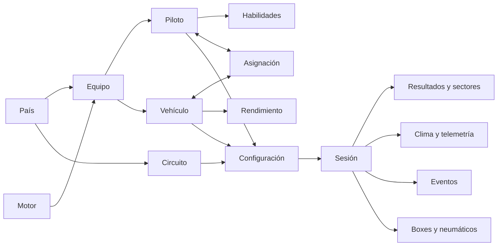
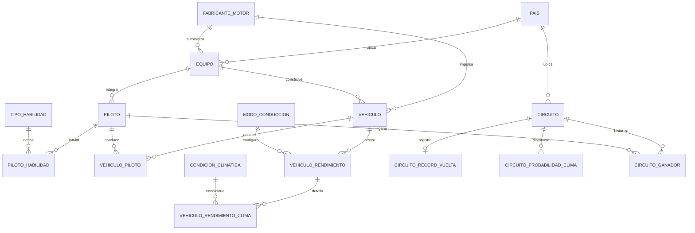
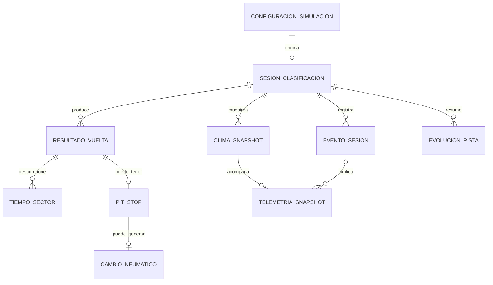
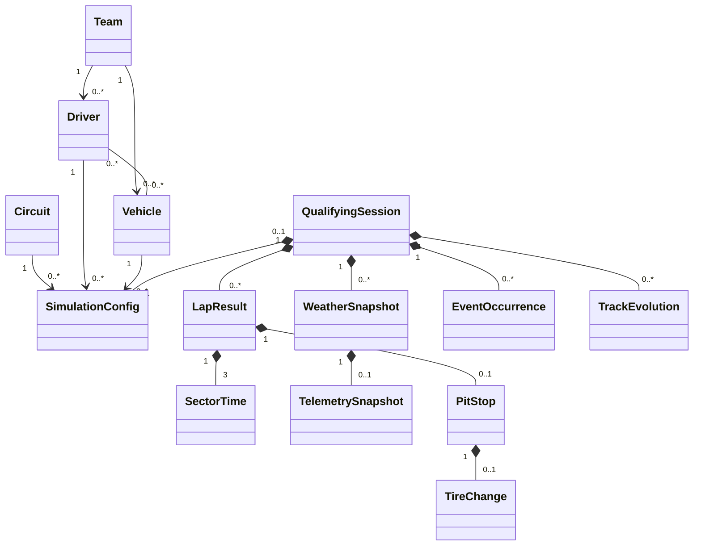

# Modelo de datos — Formula1Simulator

## 1. Alcance

Este documento es la referencia para reconstruir y mantener el modelo E-R en DrawSQL. Describe el modelo conceptual, lógico, físico, UML, las cardinalidades, la normalización y todas las claves foráneas.

Archivos ejecutables:

- [schema.sql](./schema.sql): creación de base, tablas, claves, índices, restricciones, triggers y vistas.
- [data.sql](./data.sql): población idempotente de catálogos y de todo `seed.json`.
- [03_dcl.sql](./03_dcl.sql): roles y privilegios.
- [04_tml.sql](./04_tml.sql): procedimientos transaccionales.

Orden: `schema.sql` → `data.sql` → `03_dcl.sql` → `04_tml.sql`.

## 2. Notación de cardinalidad

| Notación | Significado |
|---|---|
| `1` | Exactamente una fila. |
| `0..1` | Ninguna o una fila. |
| `0..N` | Ninguna o muchas filas. |
| `1:N` | Un padre puede tener muchas hijas; cada hija tiene un padre. |
| `N:M` | Muchos a muchos mediante tabla asociativa. |

## 3. Modelo conceptual

- Un equipo pertenece a un país, usa un fabricante de motor y agrupa pilotos y vehículos.
- Un piloto posee habilidades y puede ser asignado a vehículos compatibles.
- Un vehículo tiene rendimiento por modo de conducción y clima.
- Un circuito tiene récord, probabilidades climáticas y ganadores históricos.
- Una configuración selecciona circuito, piloto, vehículo, reglajes y duración.
- Una sesión genera resultados, sectores, clima, telemetría, eventos, evolución de pista y paradas.

## 4. Modelo lógico

### Relaciones uno a uno

| Padre | Hija | Cardinalidad | Garantía física |
|---|---|---|---|
| `circuito` | `circuito_record_vuelta` | `1 : 0..1` | La FK de la hija es también su PK. |
| `configuracion_simulacion` | `sesion_clasificacion` | `1 : 0..1` | `configuracion_id` es FK y `UNIQUE`. |
| `clima_snapshot` | `telemetria_snapshot` | `1 : 0..1` | Ambas comparten PK `(sesion_id, segmento)`. |
| `resultado_vuelta` | `pit_stop` | `1 : 0..1` | `(sesion_id, piloto_id)` es FK y `UNIQUE`. |
| `pit_stop` | `cambio_neumatico` | `1 : 0..1` | La FK de la hija es también su PK. |

### Relaciones uno a muchos

Ejemplos centrales: `pais → equipo`, `equipo → piloto`, `equipo → vehiculo`, `sesion_clasificacion → resultado_vuelta`, `resultado_vuelta → tiempo_sector`, `sesion_clasificacion → clima_snapshot`, `tipo_evento → evento_sesion` y `piloto → evolucion_pista`. La sección 8 contiene las 60 relaciones completas.

### Relaciones muchos a muchos

| Entidades | Tabla asociativa | Atributo de relación |
|---|---|---|
| Piloto ↔ Tipo de habilidad | `piloto_habilidad` | `valor`. |
| Vehículo ↔ Piloto | `vehiculo_piloto` | PK compuesta. |
| Vehículo ↔ Modo | `vehiculo_rendimiento` | Velocidad promedio. |
| Vehículo/modo ↔ Clima | `vehiculo_rendimiento_clima` | Consumo y desgaste. |
| Circuito ↔ Clima | `circuito_probabilidad_clima` | Probabilidad. |
| Circuito ↔ Piloto | `circuito_ganador` | Temporada. |
| Perfil ↔ Categoría | `perfil_probabilidad_categoria` | Probabilidad. |
| Sesión ↔ Piloto | `resultado_vuelta` | Posición y métricas. |

### E-R de maestros

### E-R de sesiones

## 5. Normalización hasta 4FN

- **1FN:** no existen listas, mapas ni grupos repetidos. Habilidades, pilotos de vehículos, rendimientos, ganadores y colecciones de sesión son filas independientes.
- **2FN:** los atributos de tablas con PK compuesta dependen de la clave completa. La velocidad por vehículo/modo está separada del consumo y desgaste por vehículo/modo/clima.
- **3FN:** países, nacionalidades, motores, roles, estados y tipos se obtienen mediante catálogos; se eliminan dependencias transitivas.
- **BCNF/4FN:** habilidades, asignaciones, rendimientos, ganadores, clima, eventos, resultados y boxes se descomponen porque son conjuntos multivaluados independientes.
- Los campos `*_snapshot` son hechos históricos del momento de la sesión, no copias del valor maestro actual; preservan el comportamiento declarado por el modelo Java.

## 6. UML del dominio persistente

## 7. Modelo físico

- MySQL 8.0.19+, InnoDB y `utf8mb4_0900_ai_ci`.
- UUID como `CHAR(36)` ASCII binario; IDs pequeños como `SMALLINT UNSIGNED`; fotogramas como `INT UNSIGNED`.
- Métricas en `DECIMAL`, PK compuestas en asociaciones, `UNIQUE` para claves candidatas y `CHECK` para invariantes.
- `ON DELETE CASCADE` se reserva para componentes dependientes del agregado.

### Catálogos de referencia

| Tabla | Propósito | PK | Columnas físicas |
|---|---|---|---|
| `pais` | Países de equipos y circuitos. | `pais_id` | `pais_id` SMALLINT UNSIGNED AUTO_INCREMENT PRIMARY KEY `nombre` VARCHAR(80) NOT NULL |
| `nacionalidad` | Nacionalidades de pilotos. | `nacionalidad_id` | `nacionalidad_id` SMALLINT UNSIGNED AUTO_INCREMENT PRIMARY KEY `nombre` VARCHAR(80) NOT NULL |
| `fabricante_motor` | Fabricantes de unidades de potencia. | `fabricante_motor_id` | `fabricante_motor_id` SMALLINT UNSIGNED AUTO_INCREMENT PRIMARY KEY `nombre` VARCHAR(80) NOT NULL |
| `rol_piloto` | Roles deportivos del piloto. | `codigo` | `codigo` VARCHAR(20) PRIMARY KEY `etiqueta` VARCHAR(40) NOT NULL UNIQUE |
| `tipo_habilidad` | Tipos de habilidad evaluable. | `codigo` | `codigo` VARCHAR(24) PRIMARY KEY `etiqueta` VARCHAR(50) NOT NULL UNIQUE |
| `modo_conduccion` | Modos de conducción. | `codigo` | `codigo` VARCHAR(32) PRIMARY KEY `etiqueta` VARCHAR(50) NOT NULL UNIQUE |
| `condicion_climatica` | Clima base y factor temporal. | `codigo` | `codigo` VARCHAR(20) PRIMARY KEY `etiqueta` VARCHAR(40) NOT NULL UNIQUE `factor_tiempo` DECIMAL(8,5) NOT NULL |
| `carga_aerodinamica` | Ajustes aerodinámicos. | `codigo` | `codigo` VARCHAR(20) PRIMARY KEY `etiqueta` VARCHAR(40) NOT NULL UNIQUE `factor_tiempo` DECIMAL(8,5) NOT NULL `factor_consumo` DECIMAL(8,5) NOT NULL `factor_desgaste` DECIMAL(8,5) NOT NULL |
| `presion_neumatico` | Presiones y factores. | `codigo` | `codigo` VARCHAR(20) PRIMARY KEY `etiqueta` VARCHAR(40) NOT NULL UNIQUE `factor_tiempo` DECIMAL(8,5) NOT NULL `factor_desgaste` DECIMAL(8,5) NOT NULL |
| `estrategia_combustible` | Estrategias de combustible. | `codigo` | `codigo` VARCHAR(20) PRIMARY KEY `etiqueta` VARCHAR(40) NOT NULL UNIQUE `factor_tiempo` DECIMAL(8,5) NOT NULL `factor_consumo` DECIMAL(8,5) NOT NULL |
| `compuesto_neumatico` | Compuestos y factores. | `codigo` | `codigo` CHAR(1) PRIMARY KEY `etiqueta` VARCHAR(20) NOT NULL UNIQUE `factor_tiempo` DECIMAL(8,5) NOT NULL `factor_desgaste` DECIMAL(8,5) NOT NULL |
| `estado_clima_dinamico` | Estados progresivos del clima. | `codigo` | `codigo` VARCHAR(30) PRIMARY KEY `etiqueta` VARCHAR(50) NOT NULL UNIQUE `condicion_codigo` VARCHAR(20) NOT NULL `factor_tiempo_base` DECIMAL(8,5) NOT NULL `estado_pista` VARCHAR(60) NOT NULL `neumatico_recomendado` VARCHAR(60) NOT NULL `estrategia_recomendada` VARCHAR(80) NOT NULL |
| `categoria_evento` | Categorías de eventos. | `codigo` | `codigo` VARCHAR(30) PRIMARY KEY `etiqueta` VARCHAR(60) NOT NULL UNIQUE |
| `alcance_evento` | Alcance individual o global. | `codigo` | `codigo` VARCHAR(20) PRIMARY KEY `etiqueta` VARCHAR(40) NOT NULL UNIQUE |
| `bandera_pista` | Banderas de pista. | `codigo` | `codigo` VARCHAR(20) PRIMARY KEY `etiqueta` VARCHAR(60) NOT NULL UNIQUE |
| `tipo_evento` | Eventos, pesos y cooldown. | `codigo` | `codigo` VARCHAR(40) PRIMARY KEY `etiqueta` VARCHAR(100) NOT NULL UNIQUE `categoria_codigo` VARCHAR(30) NOT NULL `alcance_codigo` VARCHAR(20) NOT NULL `peso_base` DECIMAL(8,4) NOT NULL `cooldown_vueltas` SMALLINT UNSIGNED NOT NULL |
| `sector_pista` | Sectores de pista. | `codigo` | `codigo` VARCHAR(20) PRIMARY KEY `numero` TINYINT UNSIGNED NULL `etiqueta` VARCHAR(40) NOT NULL UNIQUE |
| `estado_vuelta` | Validez de la vuelta. | `codigo` | `codigo` VARCHAR(20) PRIMARY KEY `etiqueta` VARCHAR(50) NOT NULL UNIQUE |
| `fase_pit_stop` | Fases de una parada. | `codigo` | `codigo` VARCHAR(20) PRIMARY KEY `etiqueta` VARCHAR(60) NOT NULL UNIQUE `completada` BOOLEAN NOT NULL DEFAULT FALSE |
| `motivo_pit_stop` | Motivos para entrar a boxes. | `codigo` | `codigo` VARCHAR(30) PRIMARY KEY `etiqueta` VARCHAR(80) NOT NULL UNIQUE |

### Maestros y rendimiento

| Tabla | Propósito | PK | Columnas físicas |
|---|---|---|---|
| `equipo` | Escuderías. | `equipo_id` | `equipo_id` SMALLINT UNSIGNED AUTO_INCREMENT PRIMARY KEY `nombre` VARCHAR(100) NOT NULL `pais_id` SMALLINT UNSIGNED NOT NULL `fabricante_motor_id` SMALLINT UNSIGNED NOT NULL `imagen_url` VARCHAR(512) NULL |
| `piloto` | Pilotos y estadísticas. | `piloto_id` | `piloto_id` SMALLINT UNSIGNED PRIMARY KEY `equipo_id` SMALLINT UNSIGNED NOT NULL `rol_codigo` VARCHAR(20) NOT NULL `nacionalidad_id` SMALLINT UNSIGNED NOT NULL `nombre` VARCHAR(100) NOT NULL `experiencia_anios` TINYINT UNSIGNED NOT NULL `numero` SMALLINT UNSIGNED NOT NULL `codigo_tv` CHAR(3) NOT NULL `victorias` SMALLINT UNSIGNED NOT NULL DEFAULT 0 `campeonatos` TINYINT UNSIGNED NOT NULL DEFAULT 0 `imagen_url` VARCHAR(512) NULL |
| `piloto_habilidad` | Habilidades por piloto. | `piloto_id` + `habilidad_codigo` | `piloto_id` SMALLINT UNSIGNED NOT NULL `habilidad_codigo` VARCHAR(24) NOT NULL `valor` TINYINT UNSIGNED NOT NULL |
| `vehiculo` | Monoplazas. | `vehiculo_id` | `vehiculo_id` SMALLINT UNSIGNED AUTO_INCREMENT PRIMARY KEY `equipo_id` SMALLINT UNSIGNED NOT NULL `fabricante_motor_id` SMALLINT UNSIGNED NOT NULL `modelo` VARCHAR(40) NOT NULL `velocidad_maxima_kmh` SMALLINT UNSIGNED NOT NULL `aceleracion_0_100` DECIMAL(5,2) NOT NULL `imagen_url` VARCHAR(512) NULL |
| `vehiculo_piloto` | Asignaciones vehículo-piloto. | `vehiculo_id` + `piloto_id` | `vehiculo_id` SMALLINT UNSIGNED NOT NULL `piloto_id` SMALLINT UNSIGNED NOT NULL |
| `vehiculo_rendimiento` | Velocidad por vehículo y modo. | `vehiculo_id` + `modo_codigo` | `vehiculo_id` SMALLINT UNSIGNED NOT NULL `modo_codigo` VARCHAR(32) NOT NULL `velocidad_promedio_kmh` SMALLINT UNSIGNED NOT NULL |
| `vehiculo_rendimiento_clima` | Consumo y desgaste por modo y clima. | `vehiculo_id` + `modo_codigo` + `condicion_codigo` | `vehiculo_id` SMALLINT UNSIGNED NOT NULL `modo_codigo` VARCHAR(32) NOT NULL `condicion_codigo` VARCHAR(20) NOT NULL `consumo_combustible` DECIMAL(7,3) NOT NULL `desgaste_neumaticos` DECIMAL(7,3) NOT NULL |
| `circuito` | Circuitos y factores técnicos. | `circuito_id` | `circuito_id` SMALLINT UNSIGNED AUTO_INCREMENT PRIMARY KEY `pais_id` SMALLINT UNSIGNED NOT NULL `nombre` VARCHAR(120) NOT NULL `longitud_km` DECIMAL(7,3) NOT NULL `vueltas` SMALLINT UNSIGNED NOT NULL `descripcion` TEXT NULL `factor_tecnico` DECIMAL(8,5) NOT NULL DEFAULT 1.40000 `factor_consumo` DECIMAL(8,5) NOT NULL DEFAULT 1.00000 `factor_desgaste` DECIMAL(8,5) NOT NULL DEFAULT 1.00000 `imagen_url` VARCHAR(512) NULL |
| `circuito_record_vuelta` | Récord único por circuito. | `circuito_id` | `circuito_id` SMALLINT UNSIGNED PRIMARY KEY `tiempo_segundos` DECIMAL(9,3) NOT NULL `titular_nombre` VARCHAR(100) NOT NULL `anio` SMALLINT UNSIGNED NOT NULL |
| `circuito_probabilidad_clima` | Clima probable por circuito. | `circuito_id` + `condicion_codigo` | `circuito_id` SMALLINT UNSIGNED NOT NULL `condicion_codigo` VARCHAR(20) NOT NULL `probabilidad` DECIMAL(8,7) NOT NULL |
| `circuito_ganador` | Ganador por circuito y temporada. | `circuito_id` + `temporada` | `circuito_id` SMALLINT UNSIGNED NOT NULL `temporada` SMALLINT UNSIGNED NOT NULL `piloto_id` SMALLINT UNSIGNED NOT NULL |

### Probabilidades de eventos

| Tabla | Propósito | PK | Columnas físicas |
|---|---|---|---|
| `perfil_probabilidad_evento` | Perfiles probabilísticos. | `perfil_id` | `perfil_id` SMALLINT UNSIGNED AUTO_INCREMENT PRIMARY KEY `nombre` VARCHAR(60) NOT NULL UNIQUE `probabilidad_coexistencia_global` DECIMAL(8,7) NOT NULL `activo` BOOLEAN NOT NULL DEFAULT FALSE |
| `perfil_probabilidad_categoria` | Probabilidad por categoría. | `perfil_id` + `categoria_codigo` | `perfil_id` SMALLINT UNSIGNED NOT NULL `categoria_codigo` VARCHAR(30) NOT NULL `probabilidad` DECIMAL(8,7) NOT NULL |

### Sesiones y telemetría

| Tabla | Propósito | PK | Columnas físicas |
|---|---|---|---|
| `configuracion_simulacion` | Selección y snapshots de configuración. | `configuracion_id` | `configuracion_id` CHAR(36) CHARACTER SET ascii COLLATE ascii_bin PRIMARY KEY `circuito_id` SMALLINT UNSIGNED NOT NULL `piloto_id` SMALLINT UNSIGNED NOT NULL `vehiculo_id` SMALLINT UNSIGNED NOT NULL `modo_codigo` VARCHAR(32) NOT NULL `carga_codigo` VARCHAR(20) NOT NULL `presion_codigo` VARCHAR(20) NOT NULL `compuesto_inicial_codigo` CHAR(1) NOT NULL `estrategia_combustible_codigo` VARCHAR(20) NOT NULL `duracion_segundos` SMALLINT UNSIGNED NOT NULL DEFAULT 10 `circuito_nombre_snapshot` VARCHAR(120) NOT NULL `piloto_nombre_snapshot` VARCHAR(100) NOT NULL `vehiculo_modelo_snapshot` VARCHAR(40) NOT NULL `guardado_en` DATETIME(3) NULL |
| `sesion_clasificacion` | Cabecera de clasificación. | `sesion_id` | `sesion_id` CHAR(36) CHARACTER SET ascii COLLATE ascii_bin PRIMARY KEY `configuracion_id` CHAR(36) CHARACTER SET ascii COLLATE ascii_bin NOT NULL `condicion_inicial_codigo` VARCHAR(20) NOT NULL `total_segmentos` INT UNSIGNED NOT NULL `fecha` DATETIME(3) NOT NULL |
| `resultado_vuelta` | Resultado final por piloto. | `sesion_id` + `piloto_id` | `sesion_id` CHAR(36) CHARACTER SET ascii COLLATE ascii_bin NOT NULL `piloto_id` SMALLINT UNSIGNED NOT NULL `vehiculo_id` SMALLINT UNSIGNED NOT NULL `posicion` TINYINT UNSIGNED NOT NULL `tiempo_segundos` DECIMAL(10,6) NOT NULL `gap_segundos` DECIMAL(10,6) NOT NULL `consumo_estimado` DECIMAL(9,5) NOT NULL `desgaste_estimado` DECIMAL(9,5) NOT NULL `piloto_nombre_snapshot` VARCHAR(100) NOT NULL `equipo_nombre_snapshot` VARCHAR(100) NOT NULL `vehiculo_modelo_snapshot` VARCHAR(40) NOT NULL `estado_codigo` VARCHAR(20) NOT NULL `sector_incidente_codigo` VARCHAR(20) NOT NULL DEFAULT 'NONE' |
| `tiempo_sector` | Parciales del resultado. | `sesion_id` + `piloto_id` + `sector_codigo` | `sesion_id` CHAR(36) CHARACTER SET ascii COLLATE ascii_bin NOT NULL `piloto_id` SMALLINT UNSIGNED NOT NULL `sector_codigo` VARCHAR(20) NOT NULL `tiempo_segundos` DECIMAL(10,6) NOT NULL |
| `clima_snapshot` | Clima por fotograma. | `sesion_id` + `segmento` | `sesion_id` CHAR(36) CHARACTER SET ascii COLLATE ascii_bin NOT NULL `segmento` INT UNSIGNED NOT NULL `estado_clima_codigo` VARCHAR(30) NOT NULL `temperatura_c` DECIMAL(7,3) NOT NULL `humedad_porcentaje` DECIMAL(7,3) NOT NULL `probabilidad_lluvia_porcentaje` DECIMAL(7,3) NOT NULL `intensidad_lluvia_porcentaje` DECIMAL(7,3) NOT NULL `temperatura_pista_c` DECIMAL(7,3) NOT NULL `grip_porcentaje` DECIMAL(7,3) NOT NULL `traccion_porcentaje` DECIMAL(7,3) NOT NULL `frenado_porcentaje` DECIMAL(7,3) NOT NULL |
| `evento_sesion` | Evento e impacto aplicado. | `evento_sesion_id` | `evento_sesion_id` BIGINT UNSIGNED AUTO_INCREMENT PRIMARY KEY `sesion_id` CHAR(36) CHARACTER SET ascii COLLATE ascii_bin NOT NULL `tipo_evento_codigo` VARCHAR(40) NOT NULL `piloto_id` SMALLINT UNSIGNED NULL `piloto_nombre_snapshot` VARCHAR(100) NULL `numero_vuelta` SMALLINT UNSIGNED NOT NULL `sector_codigo` VARCHAR(20) NOT NULL `delta_tiempo_segundos` DECIMAL(9,6) NOT NULL DEFAULT 0 `multiplicador_velocidad` DECIMAL(8,5) NOT NULL DEFAULT 1 `delta_grip_porcentaje` DECIMAL(8,4) NOT NULL DEFAULT 0 `delta_desgaste` DECIMAL(8,4) NOT NULL DEFAULT 0 `delta_temperatura_neumaticos_c` DECIMAL(8,4) NOT NULL DEFAULT 0 `delta_temperatura_motor_c` DECIMAL(8,4) NOT NULL DEFAULT 0 `delta_intensidad_lluvia_porcentaje` DECIMAL(8,4) NOT NULL DEFAULT 0 `vuelta_invalidada` BOOLEAN NOT NULL DEFAULT FALSE `piloto_fuera` BOOLEAN NOT NULL DEFAULT FALSE `bandera_codigo` VARCHAR(20) NOT NULL DEFAULT 'GREEN' |
| `telemetria_snapshot` | Telemetría por fotograma. | `sesion_id` + `segmento` | `sesion_id` CHAR(36) CHARACTER SET ascii COLLATE ascii_bin NOT NULL `segmento` INT UNSIGNED NOT NULL `velocidad_kmh` DECIMAL(8,3) NOT NULL `velocidad_maxima_kmh` DECIMAL(8,3) NOT NULL `rpm` SMALLINT UNSIGNED NOT NULL `combustible_restante_porcentaje` DECIMAL(7,3) NOT NULL `desgaste_neumaticos_porcentaje` DECIMAL(7,3) NOT NULL `temperatura_neumaticos_c` DECIMAL(7,3) NOT NULL `temperatura_motor_c` DECIMAL(7,3) NOT NULL `sector_codigo` VARCHAR(20) NOT NULL `tiempo_vuelta_segundos` DECIMAL(10,6) NOT NULL `delta_segundos` DECIMAL(10,6) NOT NULL `estado_vuelta_codigo` VARCHAR(20) NOT NULL `evento_sesion_id` BIGINT UNSIGNED NULL |
| `evolucion_pista` | Grip y goma por vuelta. | `sesion_id` + `numero_vuelta` | `sesion_id` CHAR(36) CHARACTER SET ascii COLLATE ascii_bin NOT NULL `numero_vuelta` SMALLINT UNSIGNED NOT NULL `piloto_id` SMALLINT UNSIGNED NOT NULL `piloto_nombre_snapshot` VARCHAR(100) NOT NULL `grip_inicial_porcentaje` DECIMAL(7,3) NOT NULL `grip_final_porcentaje` DECIMAL(7,3) NOT NULL `goma_inicial_porcentaje` DECIMAL(7,3) NOT NULL `goma_final_porcentaje` DECIMAL(7,3) NOT NULL `lluvia_promedio_porcentaje` DECIMAL(7,3) NOT NULL |
| `pit_stop` | Parada en boxes. | `pit_stop_id` | `pit_stop_id` CHAR(36) CHARACTER SET ascii COLLATE ascii_bin PRIMARY KEY `sesion_id` CHAR(36) CHARACTER SET ascii COLLATE ascii_bin NOT NULL `piloto_id` SMALLINT UNSIGNED NOT NULL `piloto_nombre_snapshot` VARCHAR(100) NOT NULL `numero_vuelta` SMALLINT UNSIGNED NOT NULL `segmento_entrada` INT UNSIGNED NOT NULL `segmento_actual` INT UNSIGNED NOT NULL `fase_codigo` VARCHAR(20) NOT NULL `motivo_codigo` VARCHAR(30) NOT NULL `tiempo_detenido_segundos` DECIMAL(9,6) NOT NULL `tiempo_perdido_segundos` DECIMAL(9,6) NOT NULL `posicion_entrada` TINYINT UNSIGNED NOT NULL `posicion_actual` TINYINT UNSIGNED NOT NULL |
| `cambio_neumatico` | Cambio ligado a una parada. | `pit_stop_id` | `pit_stop_id` CHAR(36) CHARACTER SET ascii COLLATE ascii_bin PRIMARY KEY `segmento` INT UNSIGNED NOT NULL `compuesto_anterior_codigo` CHAR(1) NOT NULL `compuesto_nuevo_codigo` CHAR(1) NOT NULL |

## 8. Catálogo completo de foreign keys

La cardinalidad se expresa como `cantidad máxima de hijas por padre : padres por hija`. Por eso `N : 1` es uno-a-muchos, `0..1 : 1` es uno-a-uno opcional del lado hijo y `N : 0..1` identifica una FK nullable.

| Restricción | Tabla hija y columnas | Tabla padre y columnas | Cardinalidad | Al borrar padre |
|---|---|---|---|---|
| `fk_estado_clima_condicion` | `estado_clima_dinamico(condicion_codigo)` | `condicion_climatica(codigo)` | N : 1 | RESTRICT |
| `fk_tipo_evento_categoria` | `tipo_evento(categoria_codigo)` | `categoria_evento(codigo)` | N : 1 | RESTRICT |
| `fk_tipo_evento_alcance` | `tipo_evento(alcance_codigo)` | `alcance_evento(codigo)` | N : 1 | RESTRICT |
| `fk_equipo_pais` | `equipo(pais_id)` | `pais(pais_id)` | N : 1 | RESTRICT |
| `fk_equipo_motor` | `equipo(fabricante_motor_id)` | `fabricante_motor(fabricante_motor_id)` | N : 1 | RESTRICT |
| `fk_piloto_equipo` | `piloto(equipo_id)` | `equipo(equipo_id)` | N : 1 | RESTRICT |
| `fk_piloto_rol` | `piloto(rol_codigo)` | `rol_piloto(codigo)` | N : 1 | RESTRICT |
| `fk_piloto_nacionalidad` | `piloto(nacionalidad_id)` | `nacionalidad(nacionalidad_id)` | N : 1 | RESTRICT |
| `fk_piloto_habilidad_piloto` | `piloto_habilidad(piloto_id)` | `piloto(piloto_id)` | N : 1 | CASCADE |
| `fk_piloto_habilidad_tipo` | `piloto_habilidad(habilidad_codigo)` | `tipo_habilidad(codigo)` | N : 1 | RESTRICT |
| `fk_vehiculo_equipo` | `vehiculo(equipo_id)` | `equipo(equipo_id)` | N : 1 | RESTRICT |
| `fk_vehiculo_motor` | `vehiculo(fabricante_motor_id)` | `fabricante_motor(fabricante_motor_id)` | N : 1 | RESTRICT |
| `fk_vehiculo_piloto_vehiculo` | `vehiculo_piloto(vehiculo_id)` | `vehiculo(vehiculo_id)` | N : 1 | CASCADE |
| `fk_vehiculo_piloto_piloto` | `vehiculo_piloto(piloto_id)` | `piloto(piloto_id)` | N : 1 | CASCADE |
| `fk_rendimiento_vehiculo` | `vehiculo_rendimiento(vehiculo_id)` | `vehiculo(vehiculo_id)` | N : 1 | CASCADE |
| `fk_rendimiento_modo` | `vehiculo_rendimiento(modo_codigo)` | `modo_conduccion(codigo)` | N : 1 | RESTRICT |
| `fk_rendimiento_clima_base` | `vehiculo_rendimiento_clima(vehiculo_id, modo_codigo)` | `vehiculo_rendimiento(vehiculo_id, modo_codigo)` | N : 1 | CASCADE |
| `fk_rendimiento_clima_condicion` | `vehiculo_rendimiento_clima(condicion_codigo)` | `condicion_climatica(codigo)` | N : 1 | RESTRICT |
| `fk_circuito_pais` | `circuito(pais_id)` | `pais(pais_id)` | N : 1 | RESTRICT |
| `fk_record_circuito` | `circuito_record_vuelta(circuito_id)` | `circuito(circuito_id)` | 0..1 : 1 | CASCADE |
| `fk_probabilidad_circuito` | `circuito_probabilidad_clima(circuito_id)` | `circuito(circuito_id)` | N : 1 | CASCADE |
| `fk_probabilidad_condicion` | `circuito_probabilidad_clima(condicion_codigo)` | `condicion_climatica(codigo)` | N : 1 | RESTRICT |
| `fk_ganador_circuito` | `circuito_ganador(circuito_id)` | `circuito(circuito_id)` | N : 1 | CASCADE |
| `fk_ganador_piloto` | `circuito_ganador(piloto_id)` | `piloto(piloto_id)` | N : 1 | RESTRICT |
| `fk_perfil_categoria_perfil` | `perfil_probabilidad_categoria(perfil_id)` | `perfil_probabilidad_evento(perfil_id)` | N : 1 | CASCADE |
| `fk_perfil_categoria_categoria` | `perfil_probabilidad_categoria(categoria_codigo)` | `categoria_evento(codigo)` | N : 1 | RESTRICT |
| `fk_config_circuito` | `configuracion_simulacion(circuito_id)` | `circuito(circuito_id)` | N : 1 | RESTRICT |
| `fk_config_vehiculo_piloto` | `configuracion_simulacion(vehiculo_id, piloto_id)` | `vehiculo_piloto(vehiculo_id, piloto_id)` | N : 1 | RESTRICT |
| `fk_config_modo` | `configuracion_simulacion(modo_codigo)` | `modo_conduccion(codigo)` | N : 1 | RESTRICT |
| `fk_config_carga` | `configuracion_simulacion(carga_codigo)` | `carga_aerodinamica(codigo)` | N : 1 | RESTRICT |
| `fk_config_presion` | `configuracion_simulacion(presion_codigo)` | `presion_neumatico(codigo)` | N : 1 | RESTRICT |
| `fk_config_compuesto` | `configuracion_simulacion(compuesto_inicial_codigo)` | `compuesto_neumatico(codigo)` | N : 1 | RESTRICT |
| `fk_config_estrategia` | `configuracion_simulacion(estrategia_combustible_codigo)` | `estrategia_combustible(codigo)` | N : 1 | RESTRICT |
| `fk_sesion_configuracion` | `sesion_clasificacion(configuracion_id)` | `configuracion_simulacion(configuracion_id)` | 0..1 : 1 | RESTRICT |
| `fk_sesion_condicion` | `sesion_clasificacion(condicion_inicial_codigo)` | `condicion_climatica(codigo)` | N : 1 | RESTRICT |
| `fk_resultado_sesion` | `resultado_vuelta(sesion_id)` | `sesion_clasificacion(sesion_id)` | N : 1 | CASCADE |
| `fk_resultado_vehiculo_piloto` | `resultado_vuelta(vehiculo_id, piloto_id)` | `vehiculo_piloto(vehiculo_id, piloto_id)` | N : 1 | RESTRICT |
| `fk_resultado_estado` | `resultado_vuelta(estado_codigo)` | `estado_vuelta(codigo)` | N : 1 | RESTRICT |
| `fk_resultado_sector` | `resultado_vuelta(sector_incidente_codigo)` | `sector_pista(codigo)` | N : 1 | RESTRICT |
| `fk_tiempo_sector_resultado` | `tiempo_sector(sesion_id, piloto_id)` | `resultado_vuelta(sesion_id, piloto_id)` | N : 1 | CASCADE |
| `fk_tiempo_sector_sector` | `tiempo_sector(sector_codigo)` | `sector_pista(codigo)` | N : 1 | RESTRICT |
| `fk_clima_snapshot_sesion` | `clima_snapshot(sesion_id)` | `sesion_clasificacion(sesion_id)` | N : 1 | CASCADE |
| `fk_clima_snapshot_estado` | `clima_snapshot(estado_clima_codigo)` | `estado_clima_dinamico(codigo)` | N : 1 | RESTRICT |
| `fk_evento_sesion` | `evento_sesion(sesion_id)` | `sesion_clasificacion(sesion_id)` | N : 1 | CASCADE |
| `fk_evento_tipo` | `evento_sesion(tipo_evento_codigo)` | `tipo_evento(codigo)` | N : 1 | RESTRICT |
| `fk_evento_piloto` | `evento_sesion(piloto_id)` | `piloto(piloto_id)` | N : 0..1 | RESTRICT |
| `fk_evento_sector` | `evento_sesion(sector_codigo)` | `sector_pista(codigo)` | N : 1 | RESTRICT |
| `fk_evento_bandera` | `evento_sesion(bandera_codigo)` | `bandera_pista(codigo)` | N : 1 | RESTRICT |
| `fk_telemetria_clima` | `telemetria_snapshot(sesion_id, segmento)` | `clima_snapshot(sesion_id, segmento)` | 0..1 : 1 | CASCADE |
| `fk_telemetria_sector` | `telemetria_snapshot(sector_codigo)` | `sector_pista(codigo)` | N : 1 | RESTRICT |
| `fk_telemetria_estado` | `telemetria_snapshot(estado_vuelta_codigo)` | `estado_vuelta(codigo)` | N : 1 | RESTRICT |
| `fk_telemetria_evento` | `telemetria_snapshot(evento_sesion_id)` | `evento_sesion(evento_sesion_id)` | N : 0..1 | SET NULL |
| `fk_evolucion_pista_sesion` | `evolucion_pista(sesion_id)` | `sesion_clasificacion(sesion_id)` | N : 1 | CASCADE |
| `fk_evolucion_pista_piloto` | `evolucion_pista(piloto_id)` | `piloto(piloto_id)` | N : 1 | RESTRICT |
| `fk_pit_stop_resultado` | `pit_stop(sesion_id, piloto_id)` | `resultado_vuelta(sesion_id, piloto_id)` | 0..1 : 1 | CASCADE |
| `fk_pit_stop_fase` | `pit_stop(fase_codigo)` | `fase_pit_stop(codigo)` | N : 1 | RESTRICT |
| `fk_pit_stop_motivo` | `pit_stop(motivo_codigo)` | `motivo_pit_stop(codigo)` | N : 1 | RESTRICT |
| `fk_cambio_neumatico_pit` | `cambio_neumatico(pit_stop_id)` | `pit_stop(pit_stop_id)` | 0..1 : 1 | CASCADE |
| `fk_cambio_compuesto_anterior` | `cambio_neumatico(compuesto_anterior_codigo)` | `compuesto_neumatico(codigo)` | N : 1 | RESTRICT |
| `fk_cambio_compuesto_nuevo` | `cambio_neumatico(compuesto_nuevo_codigo)` | `compuesto_neumatico(codigo)` | N : 1 | RESTRICT |

## 9. Integridad adicional

- Los triggers `trg_vehiculo_piloto_equipo_*` impiden asignar un piloto a un vehículo de otro equipo.
- Los triggers `trg_clima_segmento_*` impiden superar el total de fotogramas de la sesión.
- Las vistas `vw_probabilidad_clima_invalida` y `vw_perfil_evento_invalido` verifican distribuciones completas que sumen 1.
- `vw_clasificacion_detalle` usa nombres históricos.
- [04_tml.sql](./04_tml.sql) usa transacciones, savepoints, commit, rollback y resignal.

## 10. Uso futuro en DrawSQL

DrawSQL permite importar DDL MySQL desde **File → Import** y dibuja tablas, columnas, índices y FKs: [guía oficial](https://drawsql.app/docs/import-from-ddl).

1. Crear un diagrama MySQL.
2. Importar únicamente `schema.sql`; no importar `data.sql`.
3. Revisar el log. DrawSQL omite vistas, triggers, procedimientos e INSERTs.
4. Ordenar catálogos a la izquierda, maestros al centro y el agregado de sesión a la derecha.
5. Colocar cada tabla puente entre las dos entidades que conecta.

El lienzo gratuito admite hasta 20 tablas y este esquema tiene 43; una importación completa requiere un límite superior. Como alternativa, crear diagramas separados para catálogos, maestros/rendimiento y sesiones/telemetría, usando la sección 8 para reconstruir relaciones externas. Véanse los [límites oficiales](https://drawsql.app/docs/draw-overview).

## 11. Reglas de evolución

- Toda relación N:M debe usar una tabla asociativa.
- No guardar listas o mapas como JSON si deben consultarse o relacionarse.
- Toda FK debe usar tipos idénticos, índice compatible y política de borrado explícita.
- Los valores históricos usan `*_snapshot`; los actuales se consultan desde maestros.
- Una colección nueva de la sesión debe ser tabla hija, no columnas repetidas.
- Actualizar `schema.sql`, este documento y luego el diagrama DrawSQL.
